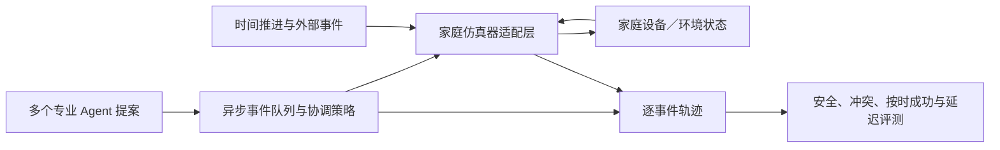

# 家庭仿真器适配可行性检查计划

日期：2026-09-26  
阶段：环境选型前的离线计划，不表示已接入 SimuHome 或其他第三方模拟器。

> 本计划的静态状态记录于 2026-09-26。2026-09-27 已完成后续 SimuHome HVAC 适配试点，21 条运行轨迹及边界见 [`SIMUHOME_HVAC_RUNTIME_PILOT_2026-09-27.md`](SIMUHOME_HVAC_RUNTIME_PILOT_2026-09-27.md)。当前“下一步”以运行报告为准；本文件后面的 9/26 状态只作为历史记录。

## 要回答的问题

HomeCoord-Bench 已有离散事件协调实验台，可控地回放任务释放、Agent 提案延迟、动作启动／完成和外部状态变化。它不是连续家庭环境。接下来的工作不是立刻重写模拟器，而是判断已有家庭仿真器能否承载我们的核心自变量：**异步专业 Agent 对同一动态家庭状态提出动作，协调策略在动作执行期间处理冲突与时限。**

HomeBench 的重点是家庭指令到 API 操作的正确映射；SimuHome 增加时间推进、环境变化和工作流。两者对环境的建模目标与 HomeCoord 不同，复用其中任何一个都需要验证适配能力，不能只因都叫“虚拟家庭”就认为可以直接接上。文献与边界比较见 `docs/EVENT_SIMULATOR_DESIGN_V0.1.md`、`docs/LITERATURE.md`。

如果现有家庭模拟器能承载设备状态，但没有多 Agent 协调接口，可以采用组合结构：

这样可以让家庭模拟器负责状态变化和动作效果，HomeCoord 层负责多 Agent 时间线、协调策略及统一测量；只有缺失动力学必须自己补齐时才扩建底层环境。

## 试点任务

用 3–5 个已存在的 episode 做离线适配测试，保持任务目标和安全判据不变：

| 代表任务 | 需要验证的环境能力 | 原因 |
|---|---|---|
| HC-PAIR-C1-HVAC-CONFLICT | 同一目标或互斥动作、并发提案、过程轨迹 | 检查直接设备冲突和动作次序 |
| HC-PHYSICAL-V2-EV-WATER-CONFLICT 与 HC-PHYSICAL-V2-EV-WATER-CONTROL（2 条匹配 episode） | 多设备功率叠加、持续动作、任务截止时间 | 检查资源容量冲突以及安全排程带来的延迟，并保留可行对照 |
| HC-M07 或配对的开窗／制冷场景 | 共享环境变量、动作依赖、状态持续性 | 检查不同设备经由环境影响形成的间接冲突 |
| HC-M16 清洁或 HC-M17 灌溉 | 执行期间发生外部事件、硬约束随状态变化 | 检查动态变化是否可被观测并写入安全轨迹 |

若外部环境不能表示最后一类执行中事件，不因此判为不可用；需要记录缺失能力，并判断它是否是第一版论文的核心变量。

适配时可用当前事件台作为语义参照：DryRun 下，HC-PAIR-C1-HVAC-CONFLICT 的独立执行出现一次 C1，而设备锁策略以降低局部任务服务换取安全；EV／热水器低容量情境中 Independent 与仅含设备锁的 RuleCoordinator 出现 C3，ConstraintCoordinator 避免超载，高容量对照下并行执行；HC-M07 暴露仅有设备锁时漏掉的共享环境变量冲突；HC-M17 在降雨后记录约 2.1 秒违规区间，因为当前环境没有动作中断能力。这些是固定动作和假设参数下的回放预期，用来检查适配器是否保留任务语义，不是物理真值或基线胜负结论。

## 每条 episode 需要的数据

无论复用还是自建环境，一条可审核的协调 episode 至少要有：

- 家庭初始状态，以及每个 Agent 在任务产生时能看到的状态与可用设备工具；
- 用户目标、任务释放时间、任务间依赖、优先级和真实可行的完成截止时间；
- 动作前置条件、作用设备／共享资源、启动效果、持续时间、完成效果、功率或资源占用，以及可否取消／补偿；
- 外部状态事件（如住户到达、降雨、设备离线）及其发生时间；
- 可重复的冲突／安全标签、最终目标判据和无冲突匹配对照；
- 若研究真实模型时延，需保存模型、提示／可见状态、原始提案、API 起止时间、重试和 Token／费用；离线模拟时延必须单独标记。

家庭设备状态与动作语义应来自可引用的环境接口、设备规格或明确标注的可控合成规则；物理参数和截止时间由领域审核者确认可行性。只有 JSON 字段齐全不能证明任务本身正确。

## 适配检查表

每项记为“原生支持／小型适配可支持／无法支持”，并保存接口和复现证据：

1. **状态与动作**：能否查询设备属性、提交离散动作，并将设备／环境状态写回共享状态？
2. **虚拟时间**：能否加速或控制时间，使任务截止时间、持续动作和调用延迟处于统一可复现时间轴？
3. **异步行为**：多个 Agent 是否能基于各自观测并行形成提案，且提案可以按指定延迟返回？若只支持同步工具调用，是否可在外层协调器中无损模拟？
4. **资源与过程**：能否表达设备互斥、功率或其他共享资源，并记录动作的开始、持续中、完成、取消及外部事件？
5. **轨迹与评测**：能否导出逐事件时间戳、动作结果和状态快照，从而独立计算安全违规、任务服务、截止成功和 P50/P95/P99 延迟？
6. **可复现与许可**：能否固定随机种子、批量运行并重置家庭；许可证是否允许研究使用、改编和最终发布必要的代码／数据？

## 验收与选型

- **适配通过**：至少 3 个试点任务可以保持原始目标、截止时间和安全不变量；异步返回与事件顺序可控；能导出机器可读轨迹；运行可重复且许可允许所需用途。再实现薄适配层，把 HomeCoord 提案和调度策略接入环境。
- **部分通过**：外部环境适合任务理解、设备状态和环境变化，但不支持所需的多 Agent 时间轴或日志。保留其家庭动力学，用外层离散事件协调器增加缺少的调度与轨迹层。
- **不通过**：关键动作、共享状态或过程轨迹无法表达，或许可不允许所需改编。继续用当前事件台做协调机制验证，同时仅补充经过来源说明和人工审核的环境动力学；在论文中清楚限定结论。

适配前只使用固定／DryRun 提案，不产生模型 API 费用。通过验收前不把两套环境的分数合并，也不宣称跨环境泛化。试点若显示现有模拟器能覆盖家庭状态和设备执行、但不能覆盖异步协调，理想结构是“家庭仿真器负责世界状态，HomeCoord 适配层负责并发提案、协调器和评测日志”，而不是二选一。

## 当前状态

- HomeCoord 离散事件实验台：95 项测试通过；事件矩阵、离线提案回放、期限扫描和延迟次序反事实共 674 次本地仿真／回放，0 次模型 API 调用。
- 当前 34 条 episode 中，有 7 条含显式外部事件（共 9 个），原始数据中仅 4 个任务标注完成截止时间；额外截止时间扫描是在试验副本上合成的敏感性条件，不应误当成已审核任务覆盖。
- 51 个持续时间至少 1 秒的动作中，26 个没有明确的启动／完成效果分相；当前动作数据也没有显式定义可中断性和停止后的效果，不能据此评估真实的运行中恢复策略。
- 674 次仿真／回放是有限情境上的重复比较，并非 674 个独立 benchmark 任务。环境适配通过后，仍需优先扩充审核任务和场景覆盖。
- SimuHome 适配：已完成公开仓库静态审查，结论与适配边界写入 `docs/SIMUHOME_ADAPTER_FEASIBILITY_AUDIT_2026-09-26.md`。确认有家庭状态、设备命令、虚拟时间快进和工作流 API；也确认 Home 单例使用串行 API 队列，workflow 步骤即时顺序执行、运行后不可取消；没有整屋功率聚合器或通用外部事件注入接口。
- SimuHome 上游仓库 README 标示 CC BY-NC-ND 4.0，并提示当前公开 benchmark snapshot 与论文表格所用版本不同。尚未下载、安装或执行其代码，也未把上游数据复制到 HomeCoord。
- 静态核对 main 当前 commit `83d28837b69f0cbf1bc02ed5334cb8b561a9d54d`；它要求 Python `>=3.13`，而当前工作区 Python 为 3.12.14。直接运行前需要可隔离的 3.13 环境及对许可用途的确认。最小试验卡、运行清单、日志字段与停止标准见 `docs/SIMUHOME_HVAC_MINIMAL_TRIAL_SPEC_2026-09-26.md`。
- 真实设备、真实并发 API、经校准的连续家庭动力学：均未接入。

### 静态审查后的决策

下一步先运行 `homecoord_bench/audit_simulator_adapter_trace.py` 的离线契约测试，再在 Python 3.13 隔离环境和固定版本上执行 HVAC 试验卡 A；A 通过后才进行 B、C。首轮不映射 EV／热水器容量冲突、开窗或雨天中断。未验证后台 tick、命令次序和 reset 重放前，不合并两套环境的分数，也不声称 SimuHome 已接入。
